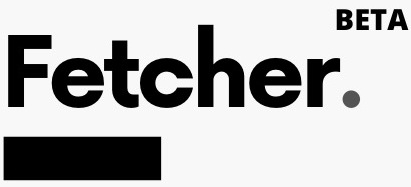

<!--  -->

# Fetcher

## Introduction

https://user-images.githubusercontent.com/99775608/157116350-4c1e1f20-a1af-4b00-9e76-8eff3c1c97a7.mp4 

(Note the video is sped up x4)

To download the official [chrome extension](https://chrome.google.com/webstore/detail/fetcher/hcjoaaeflhldlbmadokknllgaagbonla/). To see the official website, visit the [webpage](https://fetcher.page). 

## Get Started

1. Install the [chrome extension](https://chrome.google.com/webstore/detail/fetcher/hcjoaaeflhldlbmadokknllgaagbonla/)
2. Copy paste these links to the search bar (these are the ones I've been following the last week):
   - https://www.reddit.com/r/all
   - https://twitter.com/search?q=buildinpublic
   - https://twitter.com/search?q=ukraine
   - https://theguardian.com/uk
   - https://instagram.com
3) Keep the tab open in the background - every 10 minutes, Fetcher will fetch new updates from these sites.

## Motivation

Fetcher was built to automatically scrape the websites which I usually visit. Before Fetcher, I would open webpages such as Instagram, Reddit, Twitter, etc etc,
up to 10 times an hour (essentially addicted to refreshing webpages). Occasionally, refreshing the webpage gives me the same posts which I have already seen.

Fetcher was built to solve this. It launches a chrome tab every 10 minutes, and scrapes posts from my chosen list of websites. It detects which posts have already scrapped, 
and skips scrapping those again. It also gives a notifcation to show
the number of new posts which has been received. Thus, I can now focus just on the new posts, and ignore the ones I've already seen.

## Contributing

Feel free to fork and raise a PR in order to improve Fetcher. In order to add websites you are interested in, please raise a PR to extend the [data](https://github.com/neriymus/fetcher/blob/main/src/data/data.json).

## Installing and Running

### Procedures:

1. Check if your [Node.js](https://nodejs.org/) version is >= **16**.
2. Clone this repository.
3. Run `npm install` to install the dependencies.
4. Run `npm start`
5. Load your extension on Chrome following:
   1. Access `chrome://extensions/`
   2. Check `Developer mode`
   3. Click on `Load unpacked extension`
   4. Select the `build` folder.
6. To build a release, run `npm run build` instead.

---

Follow me on twitter: [Neriy](https://twitter.com/neriymus)

Buy me a [coffee](https://ko-fi.com/neriymus) ☕
